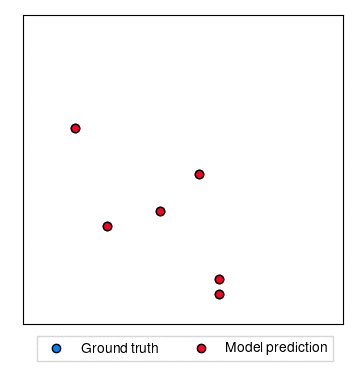
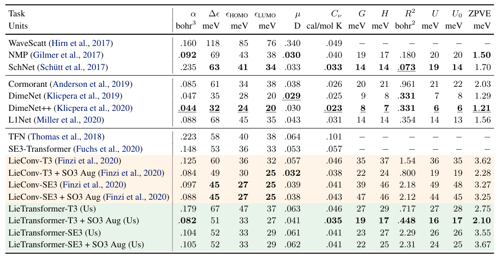
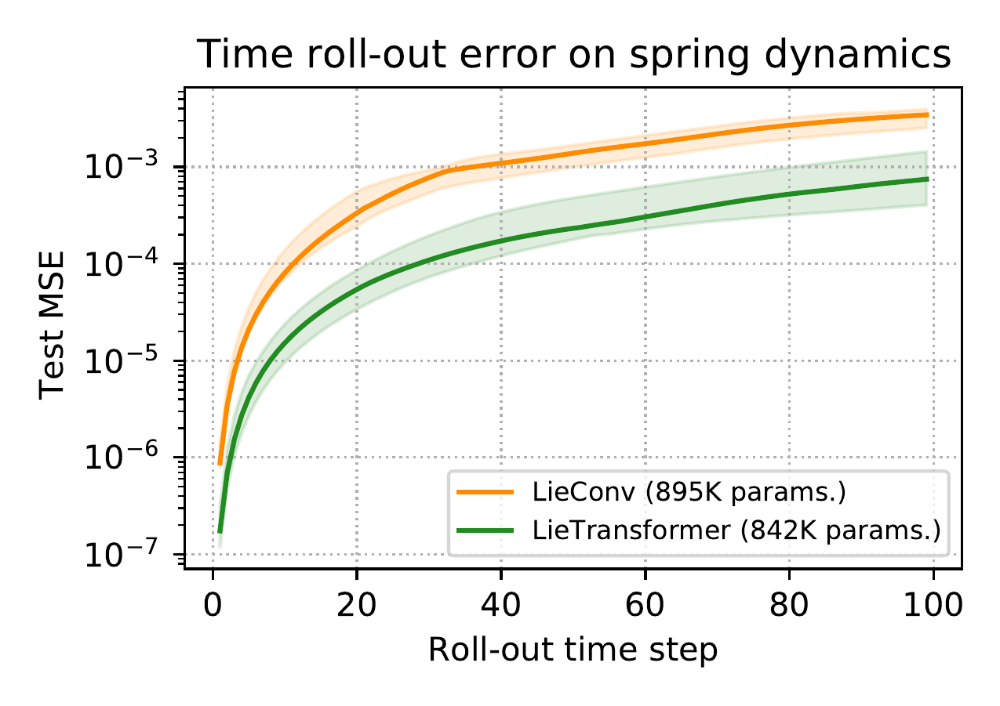
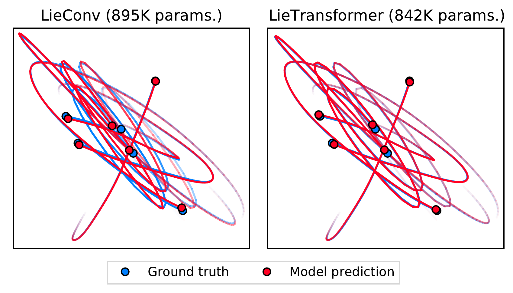

# LieTransformer

This repository contains the implementation of the LieTransformer used for experiments in the paper LieTransformer: Equivariant self-attention for Lie Groups

Pattern recognition | Molecular property prediction | Particle Dynamics
:-------------------------:|:-------------------------:|:-------------------------:
 |  | 


## Introduction

LieTransformer is a equivariant Transformer-like model, built out of equivariant self attention layers (LieSelfAttention). The model can be made equivariant to any Lie group, simply by providing and implementation of the group of interest. A number of commonly used groups are [already implemented](https://github.com/mfinzi/LieConv/blob/master/lie_conv/lieGroups.py), building off the work of [LieConv](https://github.com/mfinzi/LieConv). Switching group equivariance requires no change to model architecture, only passsing a different group to the model. 

## Architecture

The overall architecture of the LieTransformer is similar to the architecture of the original Transformer, interleaving series of attention layers and pointwise MLPs in residual blocks. The architecture of the LieSelfAttention blocks differs however, and can be seen below. For more details, please see the paper. 


## Installation

To repoduce the experiments in this library, first clone the repo via `https://github.com/anonymous-code-0/lie-transformer`. To install the dependencies and create a virtual environment, execute `setup_virtualenv.sh`. Alternatively you can install the library and its dependencies without creating a virtual environment via `pip install -e .`.

To install the library as a dependency for another project use `https://github.com/anonymous-code-0/lie-transformer`.

Alternatively, you can install all the dependencies using `pip install -r requirements.txt`. If you do so, you will need to install the LieConv, Forge, and this repo itself (using the `pip install -e` command). Please note the version of LieConv used in this project is a [slightly modified version](https://github.com/anonymous-code-0/LieConv) of [the original repo](https://github.com/mfinzi/LieConv) which fixes a bug for updated PyTorch versions.  

## Training a model

Example command to train a model (in this case the Set Transformer on the constellation dataset):
```
python3 scripts/train_constellation.py --data_config configs/constellation.py --model_config configs/set_transformer.py --run_name my_experiment --learning_rate=1e-4 --batch_size 128
```

The model and the dataset can be chosen by specifying different config files. Flags for configuring the model and
the dataset are available in the respective config files. The project is using
[forge](https://github.com/anonymous-code-0/forge) for configs and experiment management. Please refer to 
[examples](https://github.com/anonymous-code-0/forge/tree/master/forge/examples) for details.

### Counting patterns in the constellation dataset

The first task implemented is counting patterns in the constellation dataset. We generate
a fixed dataset of constellations, where each constellation
consists of 0-8 patterns; each pattern consists of corners of a shape. Currently available shapes are triangle,
square, pentagon and an L. The task is to count the number of occurences of each pattern.
To save to file the constellation datasets, run before training:
```
python3 scripts/data_to_file.py
```
Else, the constellation datasets are regenerated at the beginning of the training.

#### Dataset and model consistency
When changing the dataset parameters (e.g. number of patterns, types of patterns etc) make sure that the model
parameters are adjusted accordingly. For example `patterns=square,square,triangle,triangle,pentagon,pentagon,L,L`
means that there can be four different patterns, each repeated two times. That means that counting will involve four
three-way classification tasks, and so that `n_outputs` and `output_dim` in `classifier.py` needs to be set to `4` and
`3`, respectively. All this can be set through command-line arguments. 

#### Results


### QM9
This dataset consists of 133,885 small inorganic molecules described by the location and charge of each atom in the molecule, along with the bonding structure of the molecule. The dataset includes 19 properties of each molecule, such as various rotational constants, energies and enthalpies. We aim to predict 12 of these properties.

```
python scripts/train_molecule.py \
    --run_name "molecule_homo" \
    --model_config "configs/molecule/eqv_transformer_model.py" \
    --model_seed 0
    --data_seed 0 \
    --task homo
```

Configurable scripts for running the experiments in the paper exist in the scripts folder, `scripts/train_molecule_SE3transformer.sh`, `scripts/train_molecule_SE3lieconv.sh`.

#### Results


### Hamiltonian dynamics
In this experiment we aim to predict the trajectory of a number of particles connected together by a series of springs. This is done by learning the Hamiltonian of the system from observed trajectories.

The following command generates a dataset of trajectories and trains LieTransformer on it
```
python scripts/dynamics/train_dynamics.py \
    --activation_function swish     --architecture model_1 \ 
    --attention_fn dot_product      --batch_size 100 \
    --block_norm layer_pre          --dim_hidden 160 \
    --kernel_dim 16                 --kernel_type mlp \
    --kill_if_poor False            --learning_rate 0.001 \
    --lr_schedule cosine_annealing  --model_seed 0 \
    --n_systems 150000              --n_train 3000 \
    --num_heads 8                   --num_layers 5 \
    --num_particles 6               --run_name test_run \
    --save_check_points 500         --train_epochs 200
```

#### Results
Rollout MSE | Example Trajectories 
:-------------------------:|:-------------------------:
 | 

## Contributing

Contributions are best developed in separate branches. Once a change is ready, please submit a pull request with a
description of the change. New model and data configs should go into the `config` folder, and the rest of the code
should go into the `eqv_transformer` folder.
